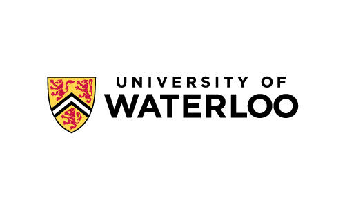

<h2 class="blackpar_title" id="Overview">Overview</h2>

This challenge will test if your retriever can generalize across different languages! The focus is on monolingual retrieval for non-English languages coming from diverse typology and language families including both high and low resource languages. This challenge is composed of two tracks:

<ol>
	<li> Known-Languages Retrieval</li>
	<li> Surprise-Languages Retrieval</li>
</ol>
 

<h2 class="blackpar_title" id="Call for Participation">Call for Participation</h2>

	TBA

 

<h2 class="blackpar_title" id="Dataset">Dataset</h2>

	TBA

 

<h2 class="blackpar_title" id="Evaluation">Evaluation</h2>

	TBA

 

<h2 class="blackpar_title" id="Schedule">Schedule</h2>

	TBA

 

<!-- Organizers -->
<h2 class="blackpar_title" id="Organizers">Organizers</h2>

	

	  
	  

		

		<h6>
			<b>Nandan Thakur</b>
			 
			University of Waterloo
		</h6>
		

	  

	

	

	  
	  

		

		<h6>
			<b>Xinyu Zhang</b>
			 
			University of Waterloo
		</h6>
		

	  

	

	

	  
	  

		

		<h6>
			<b>Odunayo Ogundepo</b>
			 
			University of Waterloo
		</h6>
		

	  

	

	

	

	  
	  

		

		<h6>
			<b>Ehsan Kamalloo</b>
			 
			University of Alberta
		</h6>
		

	  

	

	

	  
	  

		

		<h6>
			<b>David Alfonso-Hermelo</b>
			 
			Huawei Noah's Ark Lab
		</h6>
		

	  

	

	

	  
	  

		

		<h6>
			<b>Xiaoguang Li</b>
			 
			Huawei Noah's Ark Lab
		</h6>
		

	  

	

	

	  
	  

		

		<h6>
			<b>Qun Liu</b>
			 
			Huawei Noah's Ark Lab
		</h6>
		

	  

	

	

	  
	  

		

		<h6>
			<b>Mehdi Rezagholizadeh</b>
			 
			Huawei Noah's Ark Lab
		</h6>
		

	  

	

	

	  
	  

		

		<h6>
			<b>Jimmy Lin</b>
			 
			University of Waterloo
		</h6>
		

	  

	

 

<h2 class="blackpar_title">Sponsors</h2>

	
	
	

